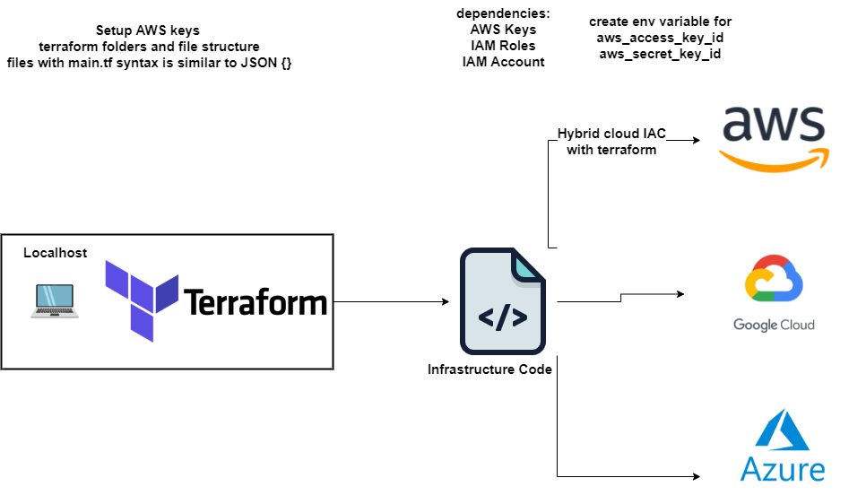
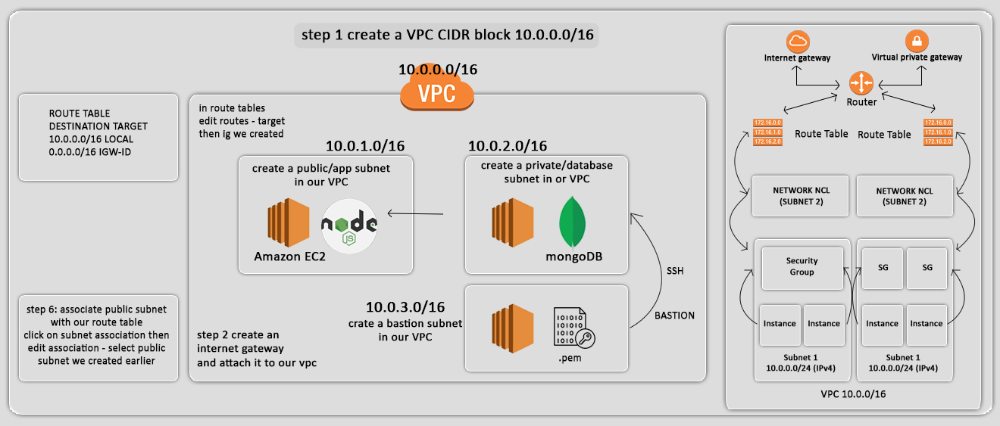

## Launching an EC2
- Once terraform file `main.tf` is configured we can launch the EC2 using `terraform plan` to validate the file then `terraform apply` to launch the EC2
- EC2 instances can be destroyed using `terraform destroy`



Create a new key pair in your local .ssh folder
Run: `ssh-keygen -t rsa -b 2048 -v -f eng89_your_name`

Create new .pem key and add to .ssh folder
Go to aws -> ec2 -> key pairs -> Create key pair -> .pem -> create
Put new .pem file in .ssh folder

Check out varaible.tf file
Check out main.tf file to see the code required to create an instance

Check and run main.tf
`terraform init` # Initialise terraform
`terraform plan` # To check if everything works, no syntax errors
`terraform apply` # Runs the main.tf file

## Ensure access and secret are added to env vars 

- Lets build a script to connect to AWS nad setup all dependencies required
- keyword: provider aws
- then we will run terraform init
- then wwill move onto launching AWS services
- Lets launhc an EC2 instance in eu-west-1 with
- keywith called "resource" provide resource name and give name with sspecific details to service
- resource aws_ec2_instance, name it as eng89_name_terraform, ami, type of instance, with or without ip,
- provide type of instance 
- assign public ip for this instance
- tags is the keyword to name the instance 


```
provider "aws" {
     region = "eu-west-1"

}

resource "aws_instance" "app_instance" {
ami = "ami-038d7b856fe7557b3"
instance_type = "t2.micro"
associate_public_ip_address = true
key_name = var.AWS_KEY_NAME

tags = {
    Name = "eng89_mueed_terraform"

    }


}
```

```
provider "aws" {
  region = var.aws_region
}

# Let's create a VPC  
resource "aws_vpc" "terraform_vpc_code_test" {
  cidr_block       = var.cidr_block 
  #"10.214.0.0/16"
  instance_tenancy = "default"
  
  tags = {
    Name = var.vpc_name
  }
} 

resource "aws_subnet" "prod-subnet-public-1" {
    vpc_id = aws_vpc.terraform_vpc_code_test.id
    cidr_block = "10.214.1.0/24"
    map_public_ip_on_launch = "true" //it makes this a public subnet
    availability_zone = "eu-west-1a"
    tags = {
        Name = "eng89_mueed_tf_app"
    }
}

resource "aws_subnet" "prod-subnet-private-1" {
    vpc_id = aws_vpc.terraform_vpc_code_test.id
    cidr_block = "10.214.2.0/24"
    map_public_ip_on_launch = "false" //it makes this a public subnet
    availability_zone = "eu-west-1a"
    tags = {
        Name = "eng89_mueed_tf_db"
    }
}


# Create Internet Gateway
resource "aws_internet_gateway" "terraform_igw" {
  vpc_id = aws_vpc.terraform_vpc_code_test.id
  
  tags = {
    Name = var.igw_name
  }
}

#Create Custom Route Table


# launch an instance
resource "aws_instance" "app_instance" {
  ami           = var.app_ami_id
  instance_type = "t2.micro"
  associate_public_ip_address = true
  tags = {
      Name = var.name
  }
   #The key_name to ssh into instance
  key_name = var.aws_key_name
  #aws_key_path = var.aws_key_path
}
```
```
# create variables for our research is main.tf to make use of DRY

variable "AWS_KEY_NAME" {
    default = "eng89_mueed_terraform"
    }

variable "aws_region" {
    default = "eu-west-1"
}


variable "name" {
  default="eng89_mueed_terraform_app"
}

variable "app_ami_id" {
  default="ami-0a6e6cb27b2ee4a95"
}

variable "vpc_id" {

  default = "vpc-0d51274b20bf95e9c"
}
variable "vpc_name" {
  default = "eng89_mueed_terraform"
}
variable "cidr_block" {
  default="10.214.0.0/16"
}
variable "igw_name" {
  default = "eng89_mueed_terraform_igw"
}

variable "aws_key_name" {

  default = "eng89_mueed_terraform"
}

variable "aws_key_path" {

  default = "~/.ssh/eng89_mueed_terraform"
}
```